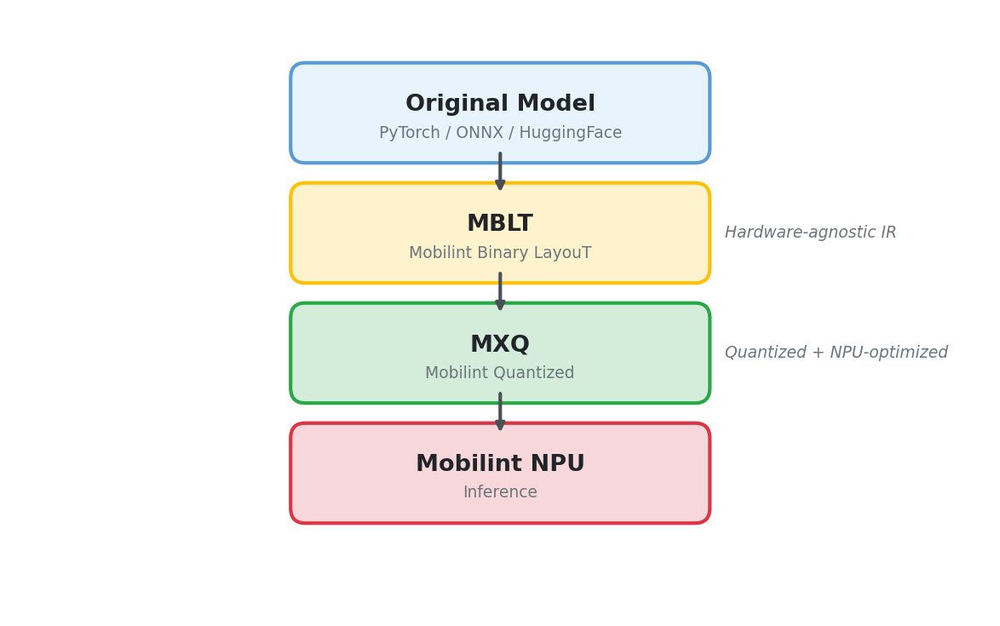

# 컴파일 파이프라인 개요

이 문서는 Mobilint qbcompiler를 사용한 모델 컴파일 파이프라인의 전체 흐름을 설명합니다.

## 개요

PyTorch, TensorFlow, ONNX 등의 모델은 GPU/CPU에서 추론하도록 설계되어 있습니다.
이러한 모델을 Mobilint NPU에서 실행하려면, NPU가 이해할 수 있는 형태로 변환(컴파일)해야 합니다.

qbcompiler는 다양한 프레임워크의 모델 변환을 지원합니다.

원본 모델의 형식은 `backend` 파라미터로 지정합니다:

| backend | 입력 형식 | 예시 모델 |
|---------|----------|----------|
| `"onnx"` | ONNX 파일 | image_classification (`resnet50.onnx`) |
| `"torch"` | PyTorch 모델 또는 HuggingFace 모델 ID | llm (`meta-llama/Llama-3.2-1B-Instruct`) |
| `"hf"` | HuggingFace 모델 (서브모델 지정 가능) | stt (`openai/whisper-small`의 encoder/decoder) |

```python
from qbcompiler import mxq_compile, mblt_compile

# ONNX 모델을 변환하는 경우 (image_classification)
mxq_compile(model="./resnet50.onnx", backend="onnx", ...)

# PyTorch / HuggingFace 모델을 변환하는 경우 (llm)
mxq_compile(model="meta-llama/Llama-3.2-1B-Instruct", backend="torch", ...)

# HuggingFace 모델의 서브모델을 지정하는 경우 (stt)
mblt_compile(model=whisper_model, backend="hf", target="encoder", ...)
mblt_compile(model=whisper_model, backend="hf", target="decoder", ...)
```

## 컴파일 파이프라인

컴파일 과정은 qbcompiler 내부적으로 **MBLT → MXQ** 두 단계를 거쳐 변환됩니다.



### MBLT (Mobilint Binary LayouT)

원본 모델의 연산 그래프와 가중치를 하드웨어 비의존적인 중간 형식으로 변환한 파일입니다.

### MXQ (Mobilint Quantized)

MBLT를 양자화하고 NPU 하드웨어에 최적화한 최종 배포 포맷입니다.
Mobilint NPU에서 직접 실행할 수 있는 `.mxq` 파일이 생성됩니다.

---

## 컴파일 방법

### `mxq_compile()`으로 한 번에 변환

대부분의 경우 `mxq_compile()`에 원본 모델을 넘기면
**MBLT → MXQ 변환이 내부적으로 자동 처리**됩니다.

사용자는 중간 MBLT 단계를 의식하지 않아도 됩니다.

```python
from qbcompiler import mxq_compile

mxq_compile(
    model="./resnet50.onnx",          # 원본 모델 경로
    calib_data_path="./calib_data",   # calibration 데이터 경로
    save_path="./resnet50.mxq",       # MXQ 저장 경로
    backend="onnx",                   # 원본 모델 형식
    device="gpu",                     # 컴파일 장치 ("gpu" 또는 "cpu")
    inference_scheme="all",           # 추론 스킴. "all"은 single, multi, global4, global8 모두 지원
)
```

### MBLT를 명시적으로 생성하는 경우

VLM이나 STT처럼 하나의 모델이 여러 서브모델(encoder/decoder, vision/language)로 구성된 경우,
각 컴포넌트의 추론 호출 횟수나 양자화 설정이 다르므로 개별적으로 MBLT를 생성해야 합니다.

예를 들어 STT는 encoder가 1회 호출되는 동안 decoder는 토큰 수만큼 반복 호출됩니다.
VLM은 vision encoder가 이미지당 1회 호출되는 반면 language model은 토큰 수만큼 반복 호출됩니다.

MBLT를 별도로 생성하는 방법은 세 가지입니다.

#### 방법 1: `mxq_compile()`에서 MBLT 저장

`mxq_compile()` 호출 시 `save_subgraph_type`과 `output_subgraph_path`를 지정하면,
MXQ 변환 과정에서 MBLT 파일을 함께 저장합니다.

```python
mxq_compile(
    model="./resnet50.onnx",
    save_subgraph_type=2,                     # MBLT 파일도 저장
    output_subgraph_path="./resnet50.mblt",   # MBLT 저장 경로
    ...
)
```

#### 방법 2: `mblt_compile()`로 별도 생성

서브모델을 분리 컴파일해야 하는 경우,
`mblt_compile()`로 MBLT를 먼저 생성한 뒤 `mxq_compile()`에 MBLT 경로를 전달합니다.

```python
from qbcompiler import mblt_compile, mxq_compile

# 1. MBLT 생성
mblt_compile(
    model=whisper_model,
    mblt_save_path="./whisper_encoder.mblt",
    backend="hf",
    target="encoder",
    device="cpu",
)

# 2. MBLT → MXQ 변환
mxq_compile(
    model="./whisper_encoder.mblt",   # MBLT 경로를 넘김
    calib_data_path="./calib_data",
    save_path="./whisper_encoder.mxq",
    ...
)
```

#### 방법 3: `ModelParser`로 직접 생성

아키텍처 패치(RoPE 캐싱, 컨볼루션 변환 등)를 적용한 뒤 MBLT를 생성해야 하는 경우,
`ModelParser`를 사용하여 모델 그래프를 파싱하고 직렬화합니다.

이 방법은 low-level API이므로 직접 사용하기보다는
각 튜토리얼에서 제공하는 high-level 함수를 참고하세요.

> 예: `vlm/mblt_compile_language.py`의 `compile_language_model()`,
> `vlm/mblt_compile_vision.py`의 `compile_vision_encoder()`

> 멀티 컴포넌트 모델의 분리 컴파일에 대해서는
> [멀티 컴포넌트 모델 가이드](./03_about_multi_component.KR.md)를 참조하세요.

---

## 모델별 컴파일 경로 요약

| 모델 유형 | backend | MBLT 생성 | 비고 |
|-----------|---------|-----------|------|
| Image Classification | `onnx` | 자동 (mxq_compile 내부) | |
| LLM | `torch` | 자동 (mxq_compile 내부) | 4bit 시 SpinQuant 추가 |
| BERT | `torch` | 자동 (mxq_compile 내부) | |
| STT (Whisper) | `hf` | 명시적 (mblt_compile) | encoder/decoder 분리 |
| VLM (Qwen2-VL) | `torch` | 명시적 (ModelParser) | vision/language 분리 |

## 다음 문서

- [양자화 설정 가이드](./01_about_quantization_config.KR.md) - `mxq_compile()`에 전달하는 config 옵션 상세 설명
- [Calibration 데이터 가이드](./02_about_calibration_data.KR.md) - calibration 데이터의 준비 및 포맷
- [멀티 컴포넌트 모델 가이드](./03_about_multi_component.KR.md) - VLM/STT 등 분리 컴파일이 필요한 모델
