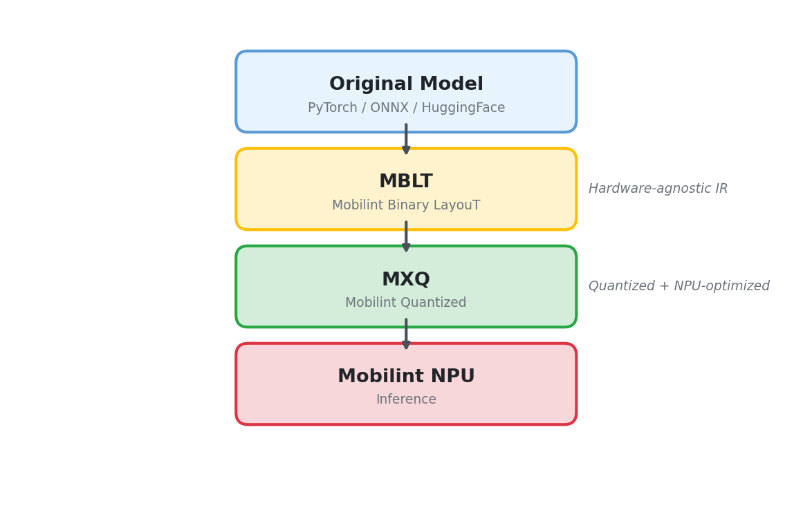

# Compilation Pipeline Overview

This document describes the overall flow of the model compilation pipeline using Mobilint qbcompiler.

## Overview

Models from PyTorch, TensorFlow, ONNX, etc. are designed to run inference on GPU/CPU.
To run these models on Mobilint NPU, they must be converted (compiled) into a format the NPU can understand.

qbcompiler supports model conversion from various frameworks.

The format of the original model is specified via the `backend` parameter (case-insensitive):

| backend | Input Format | Example in This Repository |
| --------- | ------------- | --------------- |
| `"onnx"` (default) | ONNX file path | image_classification (`resnet50.onnx`) |
| `"torch"` | PyTorch model object (`torch.nn.Module`), including a Hugging Face model | llm, bert, stt, vlm, mask_generation |
| `"tf"` (also `"tensorflow"` or `"keras"`) | TensorFlow SavedModel directory, Keras `.keras` / `.h5` file, or frozen GraphDef `.pb` | - |
| `"tflite"` | `.tflite` file path | - |
| `"torchscript"` | Archive saved with `torch.jit.save` (exported to ONNX first, so `feed_dict` is required) | - |

Any other value raises `ValueError`.
The path of an existing `.mblt` file skips parsing regardless of `backend` (see below).

```python
from qbcompiler import mblt_compile, mxq_compile

# Converting an ONNX model (image_classification)
mxq_compile(model="./resnet50.onnx", backend="onnx", target_device="aries-rb", ...)

# Converting a PyTorch model (llm): pass the loaded model object and example inputs
mblt_compile(model=model, backend="torch", target_device="aries-rb", feed_dict=feed_dict, ...)
```

### Parsing One Part of a Hugging Face Model

Models with several components (STT encoder/decoder, VLM vision/language) are parsed one part at a time with `backend="torch"`.
qbcompiler declares the parts of each supported architecture, and three helpers in `qbcompiler.model_dict.parser.patcher.parts` and `qbcompiler.model_dict.parser.backend.torch.input_capture` prepare them:

| API | Role |
| --- | --- |
| `load_for_part(model_id, part, *, dtype=None, device=None, revision=None, trust_remote_code=False)` | Loads the checkpoint with the class the parser expects for that part, in `eval()` mode |
| `prepare_part(model, part)` | Applies the part's pre-capture changes and returns the module whose inputs should be captured |
| `capture_forward_inputs(module, *, to_cpu=True, ...)` | Context manager that records the arguments of `module.forward` during one real forward pass or `generate()` call |

The captured inputs are passed as `feed_dict`, and `mblt_compile()` / `mxq_compile()` select the part with `model_part`.
`model_part_options` passes part-specific options, for example `{"last_token_only": True}` for the Whisper decoder or `{"side_inputs": True}` for the Qwen3-VL vision encoder.

```python
import torch
from qbcompiler import mblt_compile
from qbcompiler.model_dict.parser.backend.torch.input_capture import capture_forward_inputs
from qbcompiler.model_dict.parser.patcher.parts import load_for_part, prepare_part

model = load_for_part("Qwen/Qwen3-VL-2B-Instruct", "vision", dtype=torch.float32, device="cuda")
with capture_forward_inputs(prepare_part(model, "vision"), to_cpu=False) as feed_dict:
    model.generate(**inputs, max_new_tokens=1)  # one real forward pass with an image

mblt_compile(
    model=model,
    model_part="vision",
    model_part_options={"side_inputs": True},
    backend="torch",
    target_device="aries-rb",
    mblt_save_path="./qwen3vl_encoder.mblt",
    feed_dict=dict(feed_dict),
    dynamic_axes={"images": [-1], "pos_embeds": [0], "cos": [-2], "sin": [-2]},
)
```

A model that declares exactly one part resolves it without `model_part`; a model that declares several requires the name.
`qbcompiler.model_dict.parser.patcher.parts.available_parts(model)` lists the parts a loaded model declares.

### Dynamic Axes and Multiple Shapes

- `dynamic_axes` marks input axes whose size varies at runtime, for example the sequence axis of an LLM or the patch-count axis of a vision encoder.
- `multi_shape` compiles several sizes of one input axis in one call instead, for example `{"x": {"axis": 3, "values": [100, 200, 300]}}`.
  `mblt_compile()` writes one `.mblt` per size, and `mxq_compile()` packs all sizes into one `.mxq`.
  `multi_shape` requires `feed_dict` and cannot be combined with `dynamic_axes`.

## Compilation Pipeline

The compilation process internally goes through two stages: **MBLT → MXQ** within qbcompiler.



### MBLT (Mobilint Binary LayouT)

A file that converts the original model's computation graph and weights into a hardware-agnostic intermediate format.

### MXQ (Mobilint eXeQutable)

The final deployment format that quantizes the MBLT and optimizes it for NPU hardware.
A `.mxq` file that can be directly executed on Mobilint NPU is generated.

---

## Compilation Methods

### One-step conversion with `mxq_compile()`

In most cases, passing the original model to `mxq_compile()` will
**automatically handle the MBLT → MXQ conversion internally**.

Users do not need to be aware of the intermediate MBLT stage.

```python
from qbcompiler import mxq_compile

mxq_compile(
    model="./resnet50.onnx",          # Original model path
    target_device="aries-rb",         # Target device
    calib_data_path="./calib_data",   # Calibration data path
    save_path="./resnet50.mxq",       # MXQ save path
    backend="onnx",                   # Original model format
    device="gpu",                     # Compilation device ("gpu" or "cpu")
    inference_scheme="all",           # Inference scheme. "all" supports single, multi, global4, global8
)
```

### Splitting the stages: `mblt_compile()` → `mxq_compile()`

Parsing and quantization can also run as two separate stages.
`mblt_compile()` parses the model and writes a `.mblt` file; passing that `.mblt` path to `mxq_compile()` skips parsing and only quantizes and compiles.

This is how the multi-component tutorials work.
When a model consists of multiple sub-models (encoder/decoder, vision/language) like VLM or STT,
each component needs to be compiled individually since their inference call counts and quantization settings differ.
For example, in STT the encoder is called once while the decoder is called repeatedly for each token.
In VLM, the vision encoder is called once per image while the language model is called repeatedly for each token.
Splitting the stages also lets you reuse one `.mblt` for several quantization settings or target inference schemes.

```python
from qbcompiler import mblt_compile, mxq_compile

# 1. Parse: model -> MBLT
mblt_compile(
    model=model,                         # Loaded with load_for_part("openai/whisper-small", "encoder", ...)
    model_part="encoder",
    mblt_save_path="./whisper_encoder.mblt",
    backend="torch",
    target_device="aries-rb",
    feed_dict={"input_features": input_features},
)

# 2. Quantize and compile: MBLT -> MXQ
mxq_compile(
    model="./whisper_encoder.mblt",      # Pass the MBLT path
    target_device="aries-rb",
    calib_data_path="./calib_data",
    save_path="./whisper_encoder.mxq",
    ...
)
```

`mxq_compile()` routes the call by its input: `mxq_compile_from_source()` handles a framework model and `mxq_compile_from_mblt()` handles an existing `.mblt`.
Both can be called directly; their quantization arguments are the same as `mxq_compile()`.
A list of `.mblt` files is accepted only when the files are the same graph at different sizes (for example the output of a `multi_shape` parse); they are packed into one `.mxq`.

> `save_subgraph_type` and `output_subgraph_path` in `mxq_compile()` export a preview `.mblt` for visualization only.
> That preview cannot be passed back to `mxq_compile()`; use `mblt_compile()` to create a runnable `.mblt`.
>
> For split compilation of multi-component models, see
> [Multi-Component Model Guide](./03_about_multi_component.md).

---

## Per-Model Compilation Path Summary

| Model Type | backend | MBLT Generation | Notes |
| ----------- | --------- | ---------------- | ------- |
| Vision (classification, detection, ...) | `onnx` | `mblt_compile()` for inspection, `mxq_compile()` parses again | |
| LLM | `torch` | Explicit (`mblt_compile`) | SpinQuant added for 4bit |
| BERT | `torch` | `mblt_compile()` for inspection, `mxq_compile()` parses again | |
| STT (Whisper) | `torch` | Explicit (`mblt_compile(model_part=...)`) | `encoder` / `decoder` parts |
| VLM (Qwen3-VL) | `torch` | Explicit (`mblt_compile(model_part=...)`) | `vision` / `language` parts |
| Mask generation (SAM2) | `torch` | Explicit (`mblt_compile(model_part=...)`) | encoder/decoder parts |

## Related Documents

- [Compile Config Guide](./01_about_quantization_config.md) - Detailed config options passed to `mxq_compile()`
- [Calibration Data Guide](./02_about_calibration_data.md) - Preparation and format of calibration data
- [Multi-Component Model Guide](./03_about_multi_component.md) - Models requiring split compilation (VLM/STT)
