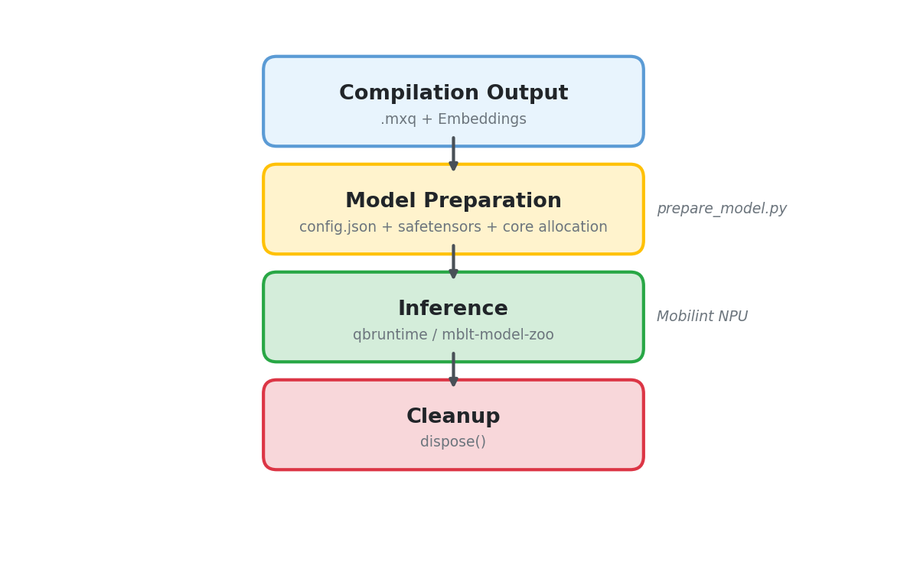

# Runtime Pipeline Overview

This document describes the overall flow from compiled `.mxq` models to inference on Mobilint NPU.

> For the compilation process, see
> [Compilation Pipeline Overview](../../compilation/_guides/00_about_compilation_pipeline.md).

---

## Runtime Pipeline



---

## Inference APIs

There are two ways to run inference on Mobilint NPU:

- **`qbruntime`** (low-level) — Direct NPU control. Load `.mxq` files and run inference with numpy arrays
- **[`mblt-model-zoo`](https://github.com/mobilint/mblt-model-zoo)** (high-level) — HuggingFace-compatible API. Automatically handles embedding separation, KV cache management, token generation loops, etc.

For models where building the inference pipeline manually is complex (LLM, VLM, STT, etc.),
`mblt-model-zoo` is recommended.

> For details, see the [Inference API Guide](./02_about_inference_api.md).

---

## Step 1: Model Preparation

When using `qbruntime`, inference is possible with just the `.mxq` file, requiring no separate preparation step.

When using `mblt-model-zoo`, run `prepare_model.py` to set up the model folder.

What this script does:

1. Copy `.mxq` files to the output folder
2. Convert embedding weights to safetensors format
3. Download config.json, tokenizer, etc. from HuggingFace
4. Add NPU settings such as `mxq_path`, `_name_or_path`, `target_cores` to config.json

Prepared model folder structure:

```text
model-folder/
├── config.json              # Includes NPU settings like mxq_path, target_cores
├── model.safetensors        # Embedding weights
├── {model}.mxq              # Compiled model (one or more)
├── tokenizer.json           # Tokenizer (for text models)
└── generation_config.json   # Generation settings (optional)
```

> For details, see the [Model Preparation Guide](./01_about_model_preparation.md).

---

## Step 2: Run Inference

Run inference with the selected API (`qbruntime` or `mblt-model-zoo`).

> For usage of each API, see the [Inference API Guide](./02_about_inference_api.md).

---

## Step 3: Resource Cleanup

NPU resources must be released after inference is complete.
Since the NPU is a shared resource, failure to clean up prevents other processes from accessing the NPU.

```python
# When using qbruntime
mxq_model.dispose()

# When using mblt-model-zoo
model.dispose()

# For multi-component models, clean up each sub-model individually
pipe.model.model.visual.dispose()
pipe.model.model.language_model.dispose()
```

---

## Next Documents

- [Model Preparation Guide](./01_about_model_preparation.md) - prepare_model.py and config.json structure
- [Inference API Guide](./02_about_inference_api.md) - qbruntime vs mblt-model-zoo
